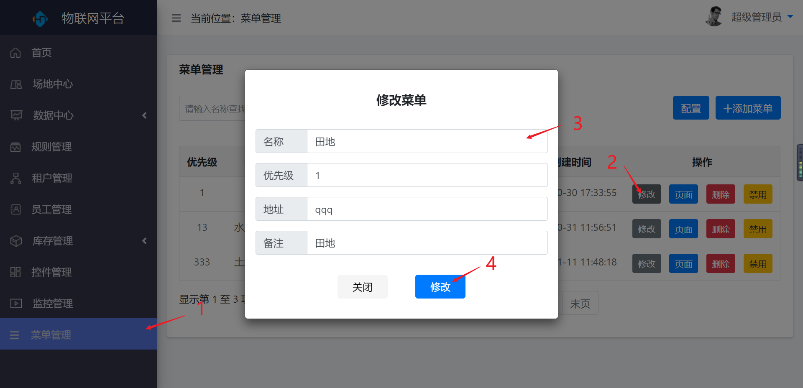
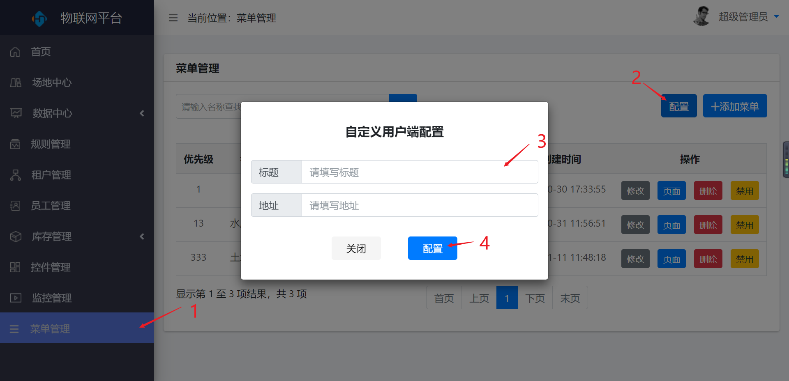

菜单管理
========

> 对菜单进行新增、修改、删除、禁用、面板、配置等操作

### 新增

* 操作步骤

1.进入系统：【菜单管理】。

2.点击【添加菜单】按钮。

3.输入菜单的基本信息。

4.点击【添加】按钮保存信息。

### 修改

* 操作步骤

1.进入系统：【菜单管理】。

2.点击操作列的【修改】按钮。

3.修改菜单的基本信息。

4.点击【修改】按钮。

### 删除

* 操作步骤

1.进入系统：【菜单管理】。

2.点击操作列的【删除】按钮。

3.在弹出的对话框中选择【确定】按钮，删除菜单。

### 禁用

* 操作步骤

1.进入系统：【菜单管理】。

2.点击操作列的【禁用】按钮。

### 面板

同【产地中心】-\>【面板】。

### 配置

* 操作步骤

1.进入系统：【菜单管理】。

2.点击【配置】按钮。

3.输入配置信息。

4.点击【配置】按钮保存。

