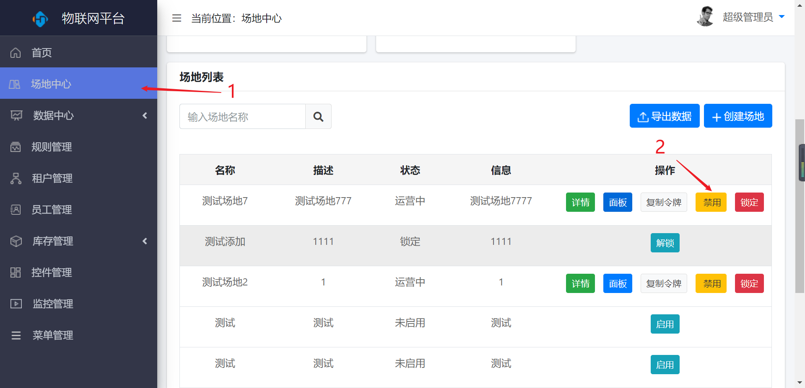

场地中心
========

> 用于用户对场地的新增、详情、面板、禁用、锁定、导出数据

### 新增场地 

* 操作步骤

1.进入系统：【场地中心】-\>【创建场地】。

2.输入场地信息。

3.点击【添加】保存。

### 编辑 
> 对已保存场地信息进行修改操作 

* 操作步骤 

1.进入系统：【场地中心】，在操作列选择【详情】。

2.点击【编辑】按钮，进行编辑。

3.点击【保存】按钮，保存。

### 禁用 
> 

* 操作步骤

1.进入系统：【场地中心】，在操作列选择【禁用】。

### 锁定

#### 操作步骤

1.进入系统：【场地中心】，在操作列选择【锁定】。

### 导出数据

* 操作步骤

1.进入系统：【场地中心】，点击【导出数据】。

面板
----

### 添加

* 操作步骤

1.进入系统：【场地中心】，在操作列选择【面板】。

2.点击【展开】，点击【添加】按钮。

3.在展开的【面板库】中，根据需要添加面板。

4.点击【关闭】，点击【保存】，保存添加。

### 编辑

* 操作步骤

1.进入系统：【场地中心】，在操作列选择【面板】，进入面板操作页面。

2.点击【展开】，点击【编辑】按钮。

3.对已有面板进行编辑，点击【保存】。

