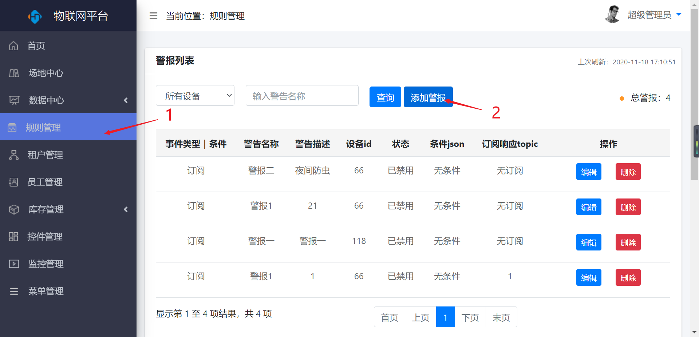
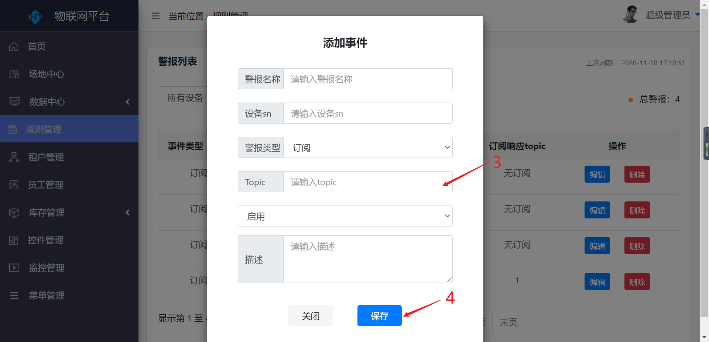
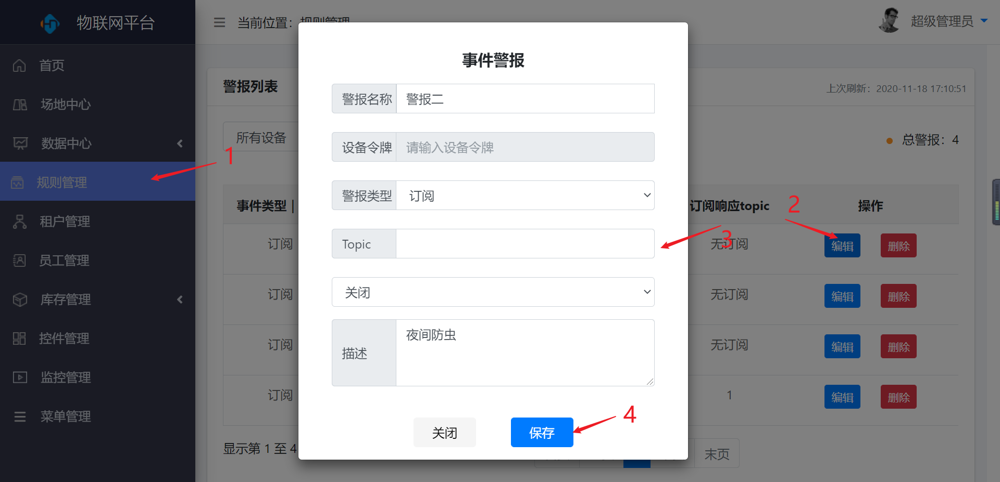
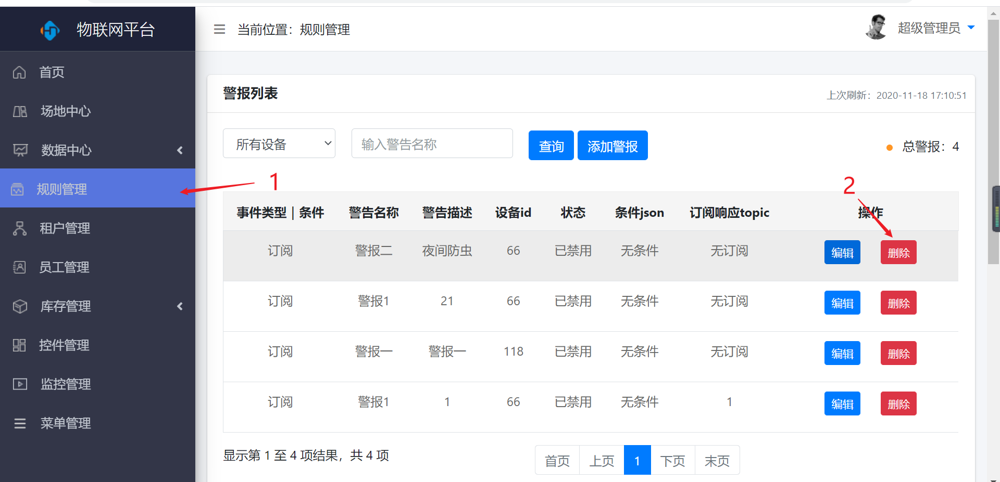
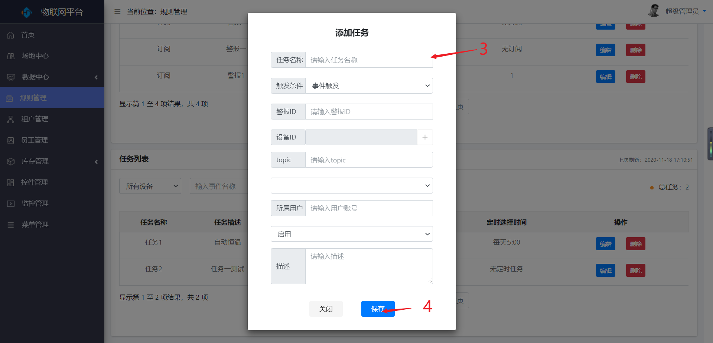
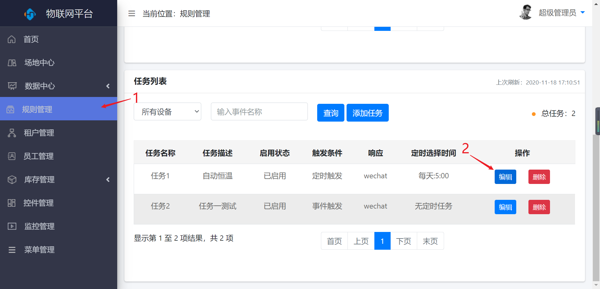
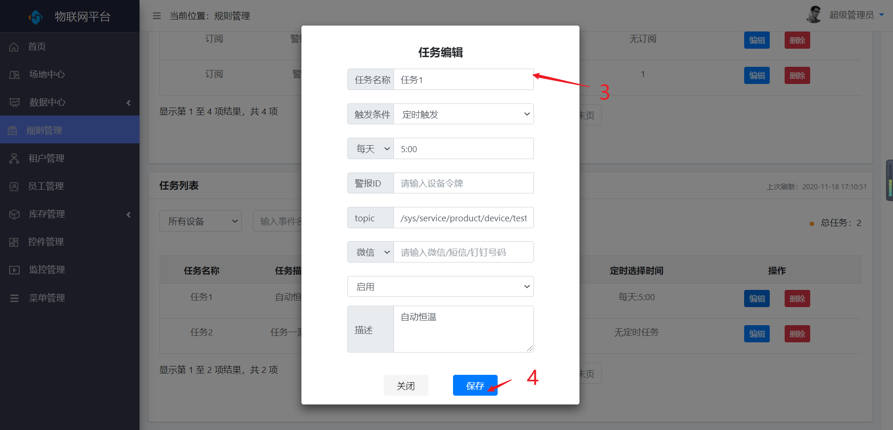
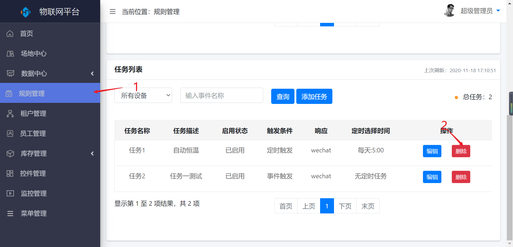

规则管理
========

警报列表
--------

> 对警报进行新增、编辑、删除操作

###  新增

* 操作步骤

1.进入系统：【规则管理】-\>【警报列表】-\>【添加警报】。

2.输入警报的基本信息。

3.点击【保存】按钮保存。

###  编辑

* 操作步骤

1.进入系统：【规则管理】-\>【警报列表】。

2.点击操作列【编辑】按钮。

3.编辑警报信息。

4.点击【保存】按钮，保存。

###  删除

* 操作步骤

1.进入系统：【规则管理】-\>【警报列表】。

2.点击操作列【删除】按钮。

任务列表
--------

> 对任务进行新增、编辑、删除操作

###  新增

* 操作步骤

1.进入系统：【规则管理】-\>【任务列表】-\>【添加任务】。

2.输入任务的基本信息。

3.点击【保存】按钮保存。

###  编辑

* 操作步骤

1.进入系统：【规则管理】-\>【任务列表】。

2.点击操作列【编辑】按钮。

3.编辑任务信息。

4.点击【保存】按钮，保存。

###  删除

1.进入系统：【规则管理】-\>【人物列表】。

2.点击操作列【删除】按钮。

