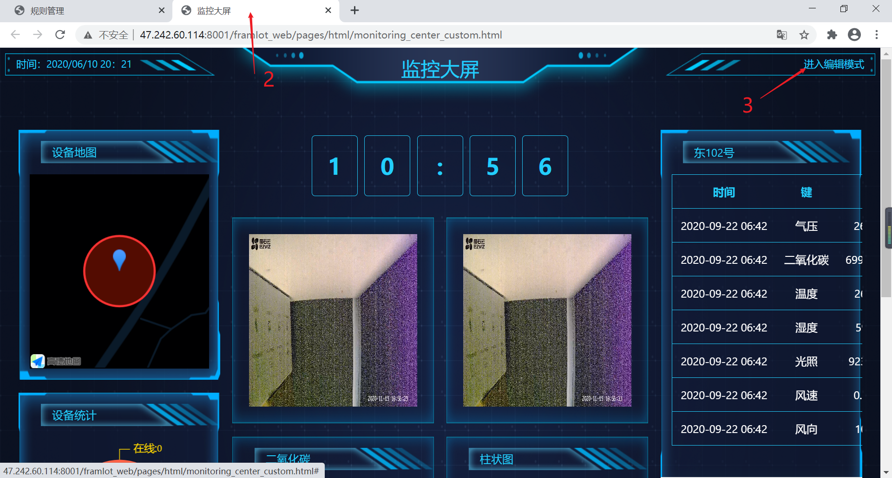
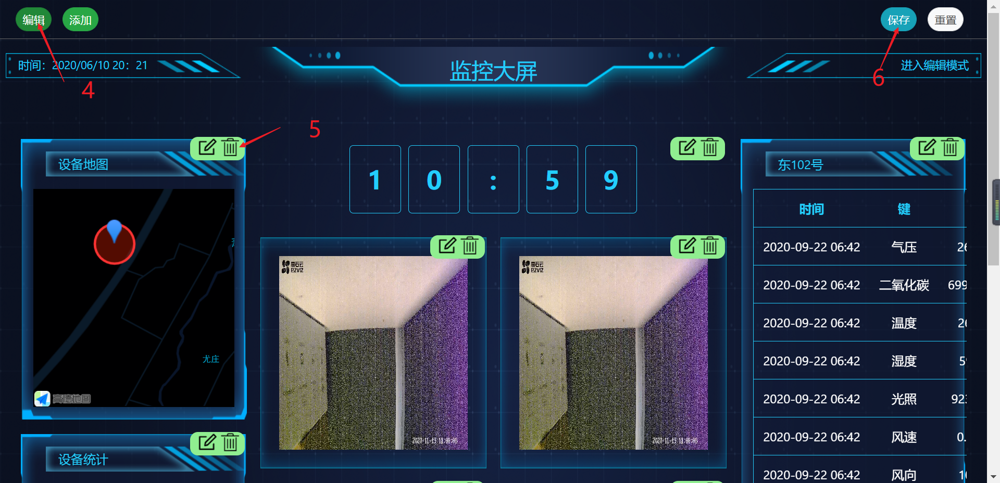
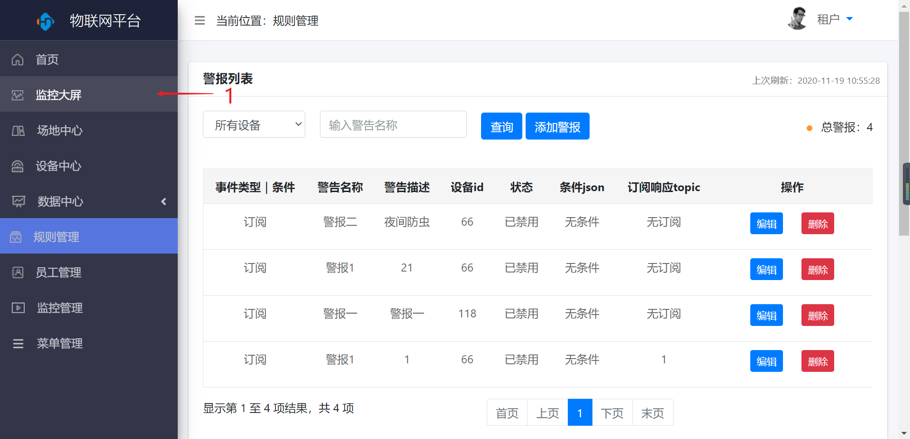
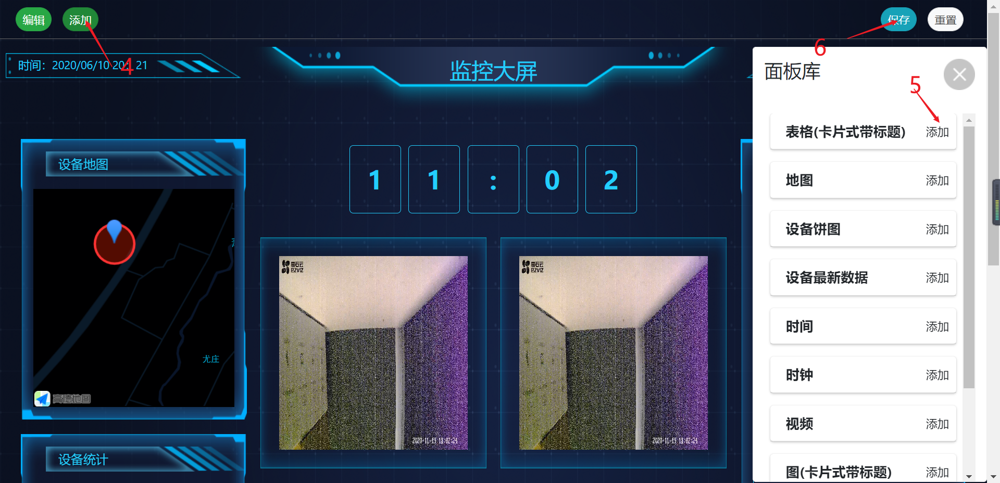

监控大屏
========

> 对监控大屏进行添加面板，编辑现有面板保存或重置编辑后的监控大屏

### 编辑

* 操作步骤

1.进入系统：【监控大屏】。

2.进入监控大屏页面。

3.点击【进入编辑】按钮。

4.点击【编辑】按钮。

5.对控件进行编辑。

6.点击【保存】按钮，保存编辑。

### 添加

* 操作步骤

1.进入系统：【监控大屏】。

2.进入监控大屏页面。

3.点击【进入编辑】按钮。

4.点击【添加】按钮。

5.选择要添加的控件进行添加。

6.点击【保存】按钮，保存添加。

