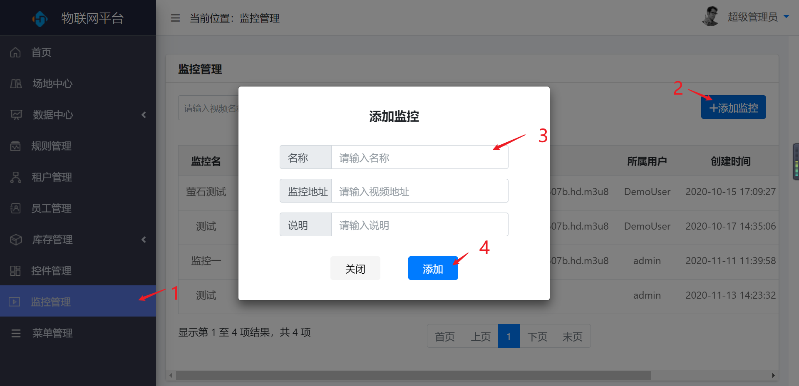
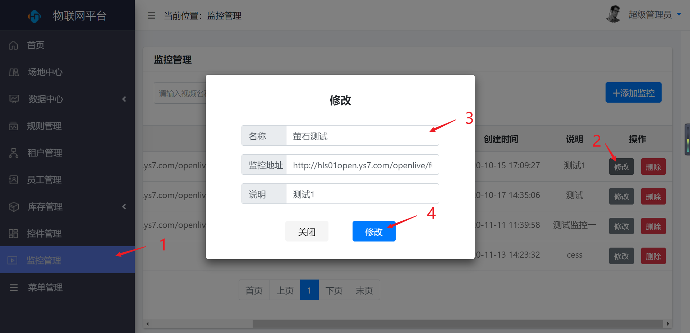
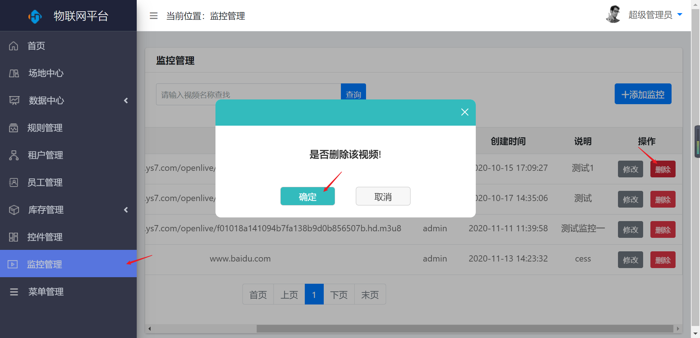

监控管理
========

> 对监控进行新增、修改、删除等操作

### 新增

* 操作步骤

1.进入系统：【监控管理】。

2.点击【添加监控】按钮。

3.输入监控信息。

4.点击【添加】按钮保存。

### 修改

* 操作步骤

1.进入系统：【监控管理】。

2.点击操作列【修改】按钮。

3.修改监控信息。

4.点击【修改】按钮保存。

### 删除

* 操作步骤

1.进入系统：【监控管理】。

2.点击操作列【删除】按钮。

3.在弹出的对话框点击【确定】按钮。

