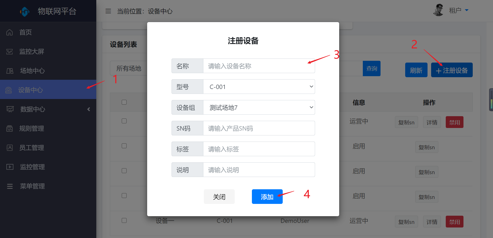
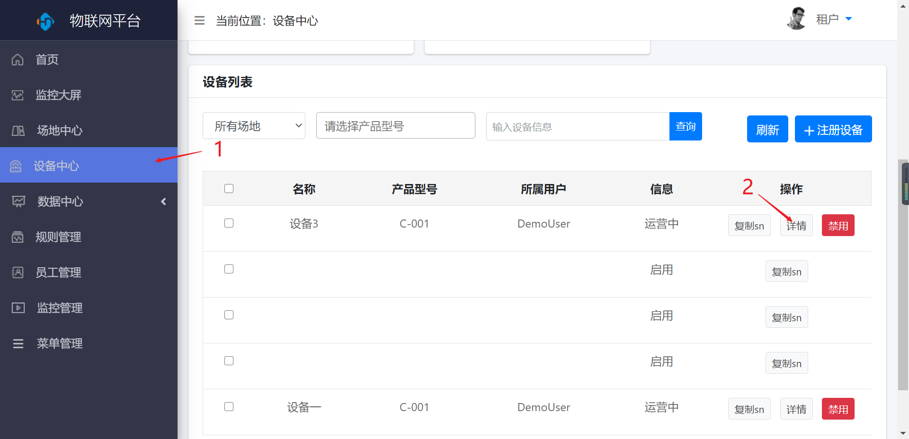
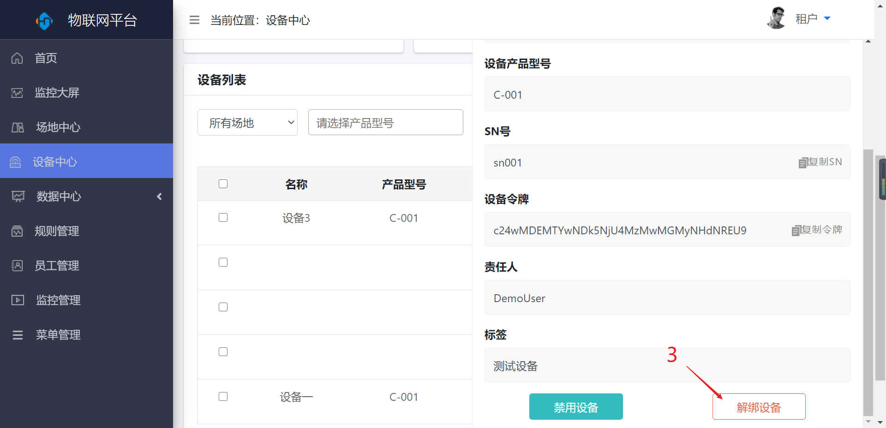
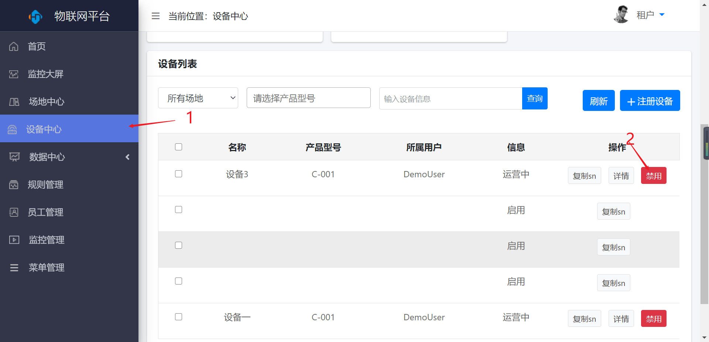

设备中心
========

> 对设备进行新增、详情查看、禁用等操作

### 新增

* 操作步骤

1.进入系统：【设备中心】。

2.点击【注册设备】按钮。

3.输入设备信息。

4.点击【添加】按钮保存。

### 解绑

* 操作步骤

1.进入系统：【设备中心】。

2.选择操作列【详情】按钮。

3.点击【解绑设备】按钮解绑设备。

### 禁用

* 操作步骤

1.进入系统：【设备中心】。

2.选择操作列【禁用】按钮。

