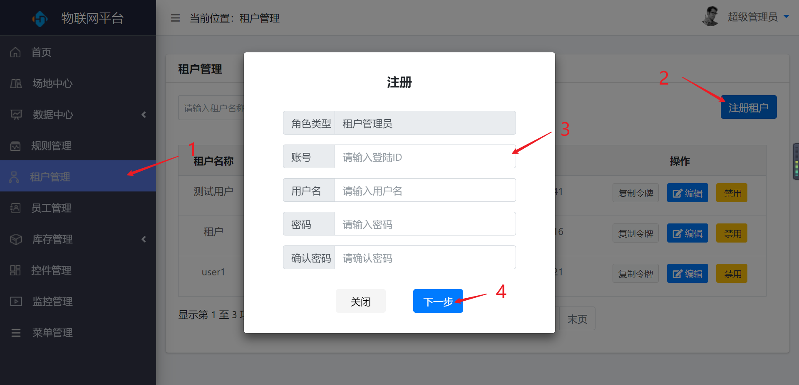
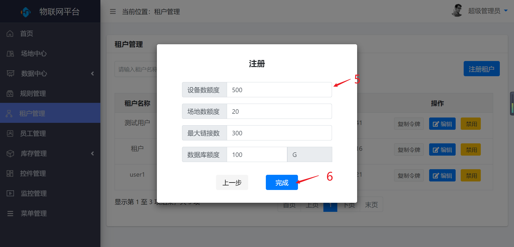
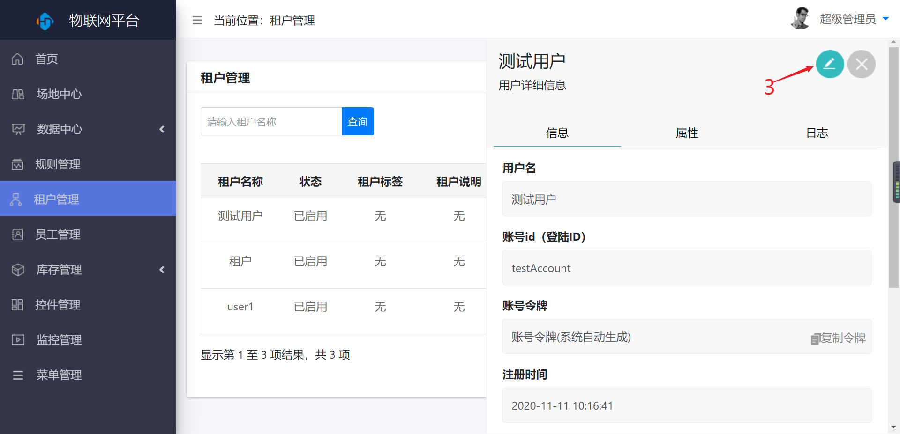
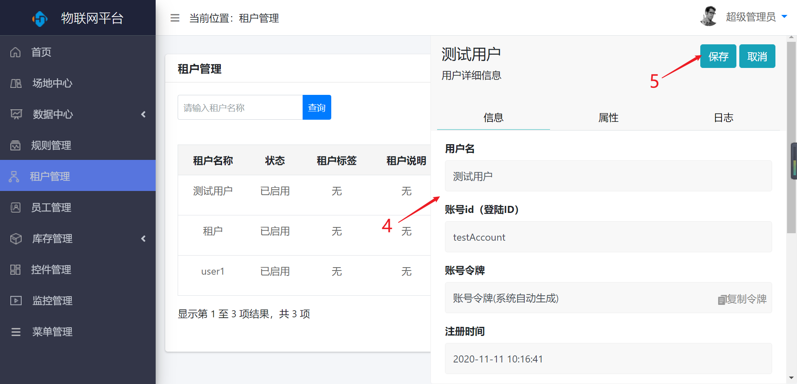
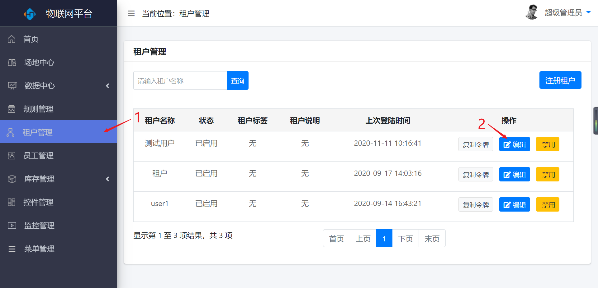
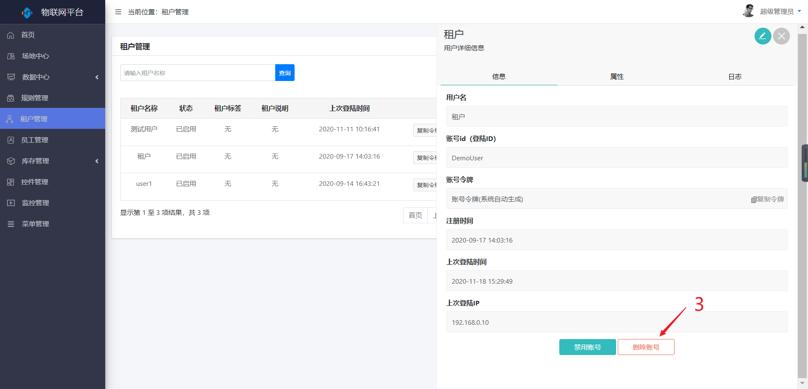
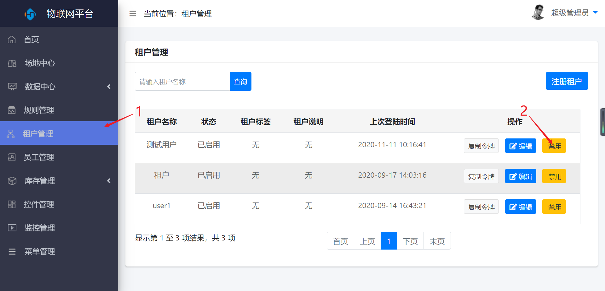

租户管理
========

> 对租户进行新增、编辑和禁用操作

### 新增

* 操作步骤

1.进入系统：【租户管理】-\>【注册租户】。

2.输入租户信息。

3.点击【下一步】按钮。

4.根据需要分配设备数量。

5.点击【完成】按钮进行保存。

### 编辑

* 操作步骤

1.进入系统：【租户管理】。

2.点击操作列【编辑】按钮。

3.在弹出的编辑栏中点击【编辑】按钮。

4.对租户进行编辑。

5点击【保存】按钮，保存信息。

### 删除

* 操作步骤

1.进入系统：【租户管理】。

2.点击操作列【编辑】按钮。

3.在弹出的编辑栏中点击【删除账号】按钮，删除租户。

### 禁用

* 操作步骤

1.进入系统：【租户管理】。

2.点击操作列【禁用】按钮。

