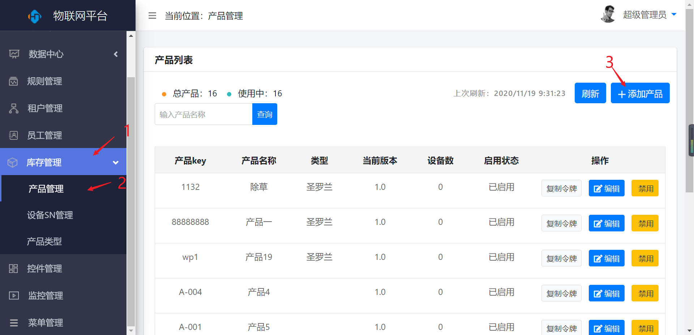
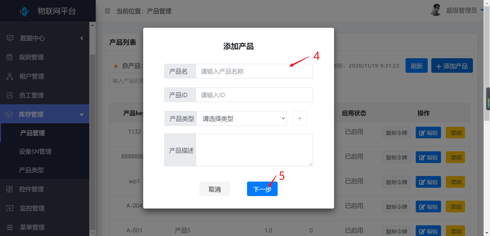
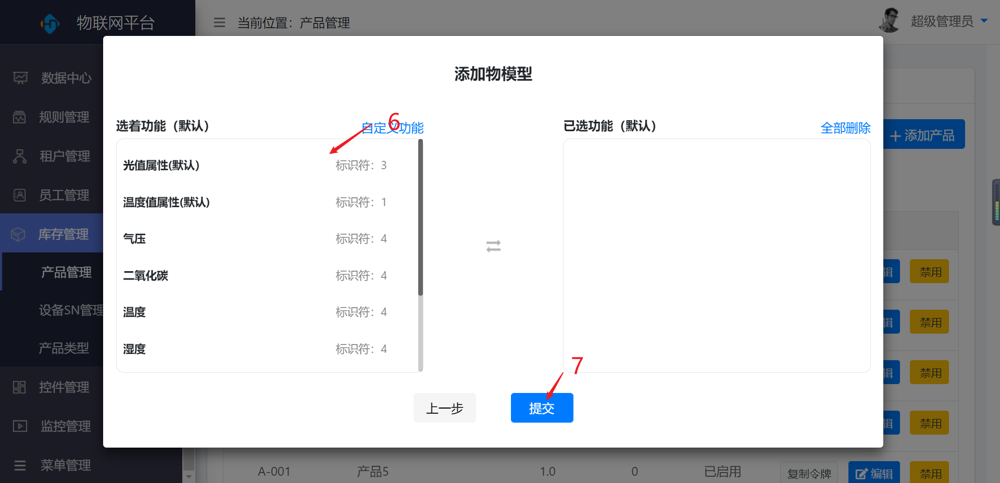
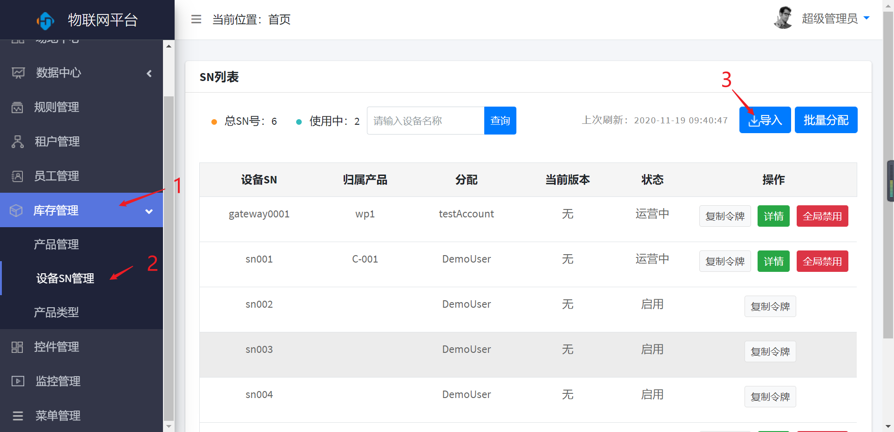
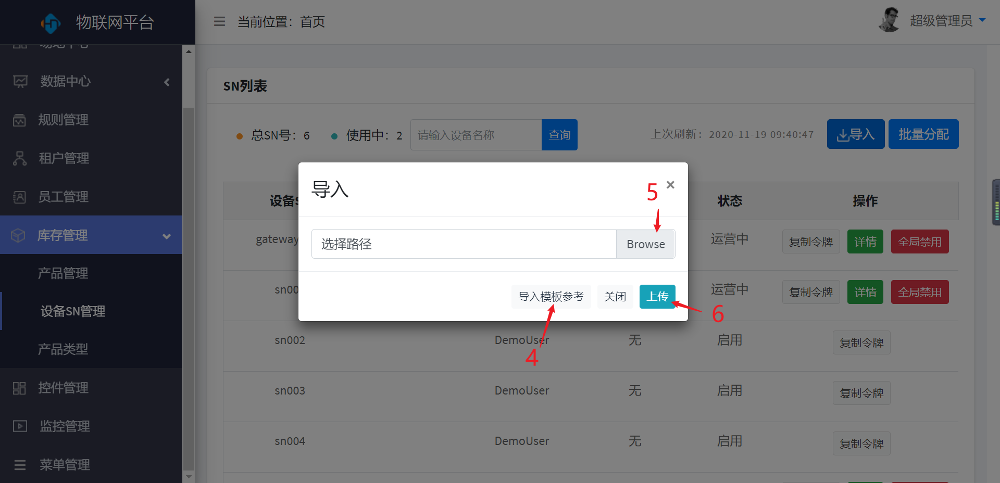
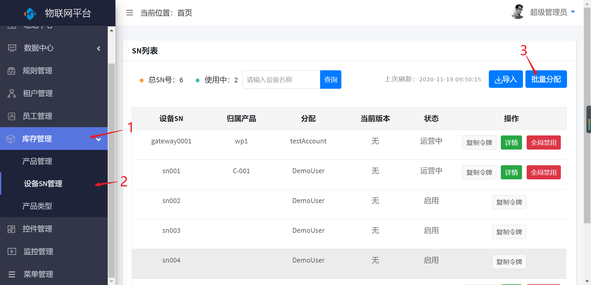
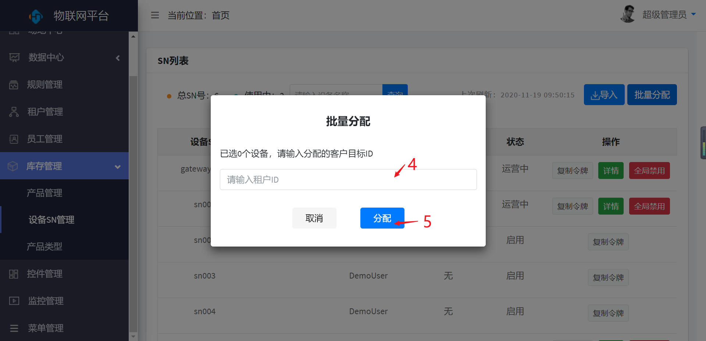
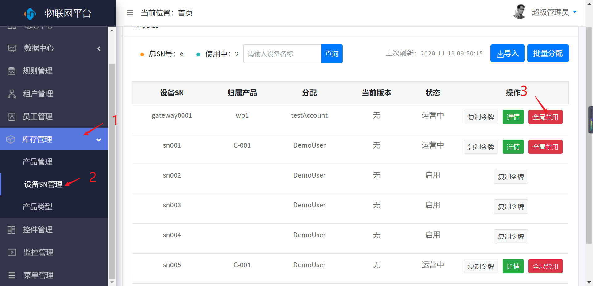
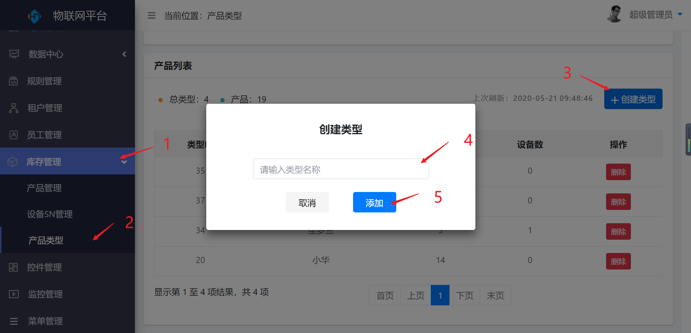
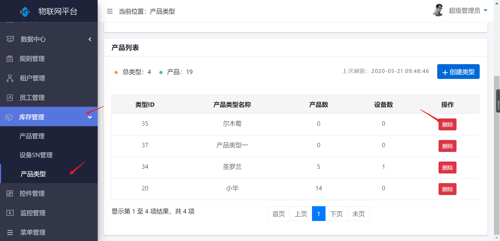

库存管理
========

 产品管理
--------

> 对产品进行新增、编辑、禁用操作

### 新增

* 操作步骤

1.进入系统：【库存管理】-\>【产品管理】。

2.点击【添加产品】按钮。

3.输入产品的基本信息。

4.点击【下一步】按钮。

5.选择产品功能。

6.点击【提交按钮】保存。

<!-- ### 编辑

同【员工管理】-\>【编辑】

### 删除

同【员工管理】-\>【删除】

### 禁用

同【员工管理】-\>【禁用】 -->

 设备SN管理
----------

> 导入新的SN号，对现有的设备SN号批量分配、查看详情以及全局禁用

### 导入

* 操作步骤

1.进入系统：【库存管理】-\>【设备SN管理】。

2.点击【导入】按钮。

3.点击【导入模板参考】按钮。

4.点击【Browse】按钮。

5.选择与模板相同的文件上传。

5.点击【上传】按钮，保存导入。

### 批量分配

* 操作步骤

1.进入系统：【库存管理】-\>【设备SN管理】。

2.点击【批量分配】按钮。

3.输入租户ID。

4.点击【分配】按钮。

### 全局禁用

* 操作步骤

1.进入系统：【库存管理】-\>【设备SN管理】。

2.点击操作列【全局禁用】按钮。

 产品类型
--------

> 新增和删除产品类型

### 新增

* 操作步骤

1.进入系统：【库存管理】-\>【产品类型】。

2.点击【创建类型】按钮。

3.输入产品名称。

4.点击【添加】按钮，保存。

### 删除

* 操作步骤

1.进入系统：【库存管理】-\>【产品类型】。

2.点击操作列【删除】按钮。

