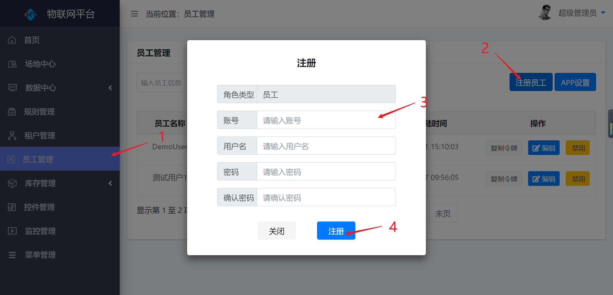
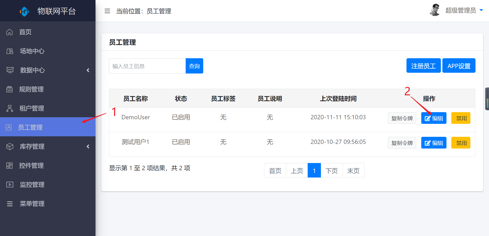
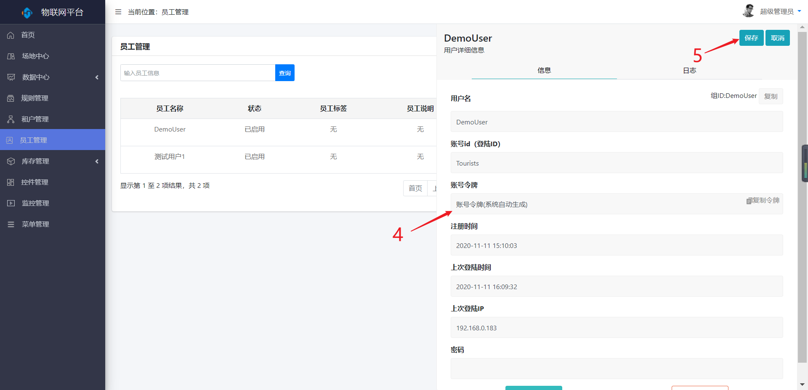
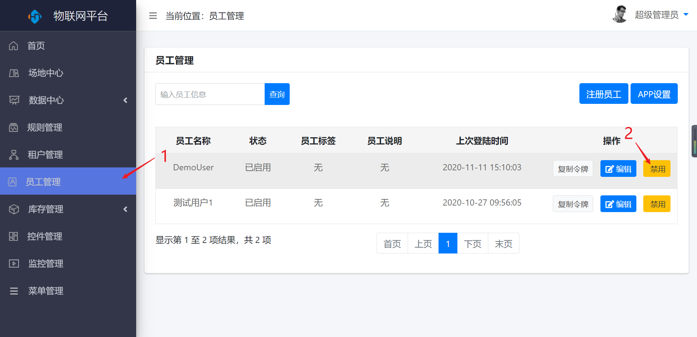
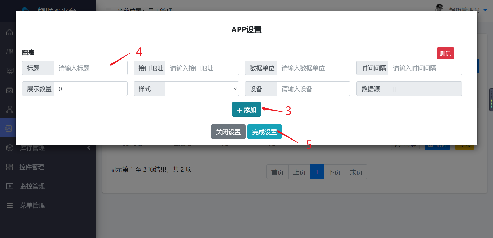

员工管理
========

> 对员工进行新增、编辑、禁用和App设置

### 新增

* 操作步骤

1.进入系统：【员工管理】-\>【注册员工】。

2.输入员工的基本信息。

3.点击【注册】按钮，保存新增员工。

### 编辑

* 操作步骤

1.进入系统：【员工管理】。

2.点击操作列【编辑】按钮。

3.在弹出的编辑栏选择【编辑】按钮。

4.修改员工信息。

5.点击【保存】按钮保存。

### 删除

* 操作步骤

1.进入系统：【员工管理】。

2.点击操作列【编辑】按钮。

3.在弹出的编辑栏选择【删除账号】按钮。

4.在弹出的对话框中选择【确定】按钮。

### 禁用

* 操作步骤

1.进入系统：【员工管理】。

2.点击操作列【禁用】按钮。

### App设置

* 操作步骤

1.进入系统：【员工管理】。

2.点击【APP设置】按钮。

3.在弹出的对话框中点击【添加】按钮。

4.输入新增图表的信息。

5.点击【完成设置】按钮保存。

